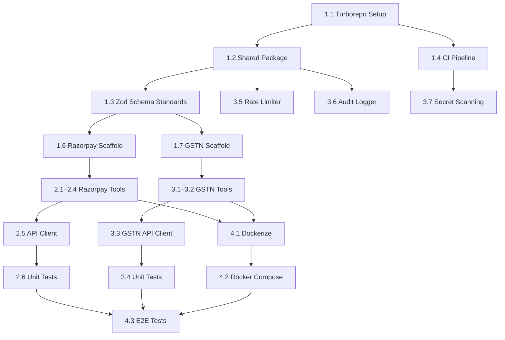

# Bharat-MCP — Development Phase Report: Initial Phase (MVP)

**Version**: 1.0
**Phase**: Phase 1 — MVP (Weeks 1–4)
**Date**: March 2, 2026
**Status**: Planning Complete → Ready for Execution

---

## 1. Phase Objective

Ship the foundational Bharat-MCP monorepo with two production-ready MCP servers (`mcp-server-razorpay` and `mcp-server-gstn`), a local Docker-based deployment, and baseline security/compliance guardrails — all within a 4-week sprint cycle.

---

## 2. Sprint Breakdown

### Sprint 1 — Foundation (Week 1)

> [!IMPORTANT]
> This sprint is the critical path. All subsequent work depends on the monorepo scaffold and shared utilities being stable.

| # | Task | Owner | Est. | Deliverable |
|:--|:-----|:------|:-----|:------------|
| 1.1 | Initialize Turborepo monorepo with TypeScript config | Lead Dev | 0.5d | Working `turbo.json`, shared `tsconfig`, lint/format config |
| 1.2 | Create `packages/shared` — common types, error classes, logger | Lead Dev | 1d | Shared package with MCP base types, custom error hierarchy, structured logger (pino) |
| 1.3 | Define MCP tool schema standards (Zod) | Lead Dev | 1d | Zod schema templates + validation middleware for tool inputs/outputs |
| 1.4 | Setup CI pipeline (GitHub Actions) | DevOps | 1d | Lint → Type-check → Test → Build pipeline on every PR |
| 1.5 | Setup credential management pattern | Security | 0.5d | Environment variable injection strategy, `.env.example`, secret scrubbing in logs |
| 1.6 | Create `packages/mcp-server-razorpay` scaffold | Dev 1 | 1d | Empty MCP server that connects via stdio, registers no tools, passes health check |
| 1.7 | Create `packages/mcp-server-gstn` scaffold | Dev 2 | 1d | Same as 1.6 for GSTN server |

**Sprint 1 Exit Criteria:**
- [x] `pnpm turbo build` succeeds across all packages
- [x] CI pipeline runs green on `main`
- [x] Both server scaffolds connect via stdio and respond to `initialize`

---

### Sprint 2 — Razorpay Server Core (Week 2)

| # | Task | Owner | Est. | Deliverable |
|:--|:-----|:------|:-----|:------------|
| 2.1 | Implement `create_order` tool | Dev 1 | 1d | Creates Razorpay order, returns order ID + amount + status. Requires `idempotency_key`. |
| 2.2 | Implement `fetch_payment_status` tool | Dev 1 | 0.5d | Fetches payment by ID, returns enriched status with settlement info |
| 2.3 | Implement `trigger_refund` tool | Dev 1 | 1d | Initiates refund with `idempotency_key`, validates amount ≤ captured amount |
| 2.4 | Implement `list_subscriptions` tool | Dev 1 | 0.5d | Paginated subscription listing with status filters |
| 2.5 | Razorpay API client wrapper | Dev 1 | 1d | Typed HTTP client with retry logic, error mapping, rate limit handling |
| 2.6 | Unit tests for all Razorpay tools | Dev 1 | 1d | ≥80% coverage, mocked API responses, edge case validation |

**Tool Schema Examples:**

```typescript
// create_order input schema
const CreateOrderInput = z.object({
  amount: z.number().positive().describe("Amount in paise (INR smallest unit)"),
  currency: z.literal("INR").default("INR"),
  receipt: z.string().optional().describe("Your internal order receipt ID"),
  idempotency_key: z.string().uuid().describe("Unique key to prevent duplicate orders"),
  notes: z.record(z.string()).optional()
});
```

**Sprint 2 Exit Criteria:**
- [ ] All 4 Razorpay tools respond correctly with mocked upstream APIs
- [ ] Idempotency enforced on mutation tools
- [ ] Unit tests pass at ≥80% coverage

---

### Sprint 3 — GSTN Server + Security Layer (Week 3)

| # | Task | Owner | Est. | Deliverable |
|:--|:-----|:------|:-----|:------------|
| 3.1 | Implement `search_taxpayer_by_gstin` tool | Dev 2 | 1d | Accepts GSTIN, returns taxpayer name, status, registration date |
| 3.2 | Implement `verify_filing_status` tool | Dev 2 | 1d | Accepts GSTIN + financial year, returns filing compliance status |
| 3.3 | GSTN API client wrapper | Dev 2 | 1d | Typed client with sandbox mode toggle, ASP/GSP auth flow |
| 3.4 | Unit tests for all GSTN tools | Dev 2 | 0.5d | ≥80% coverage |
| 3.5 | Implement token-bucket rate limiter | Security | 1d | Per-tool configurable rate limits, circuit breaker on threshold breach |
| 3.6 | Implement audit logging system | Security | 1d | Crypto trace IDs linking prompt → tool call → API request, structured JSON logs |
| 3.7 | Add `gitleaks` / `trufflehog` to CI | DevOps | 0.5d | Block PRs that contain secrets in code or config |

**Sprint 3 Exit Criteria:**
- [ ] Both GSTN tools respond correctly with mocked/sandbox APIs
- [ ] Rate limiter prevents >N calls/min per tool (configurable)
- [ ] Every tool invocation produces an audit log entry with trace ID
- [ ] CI blocks secret leaks

---

### Sprint 4 — Packaging, Integration & Docs (Week 4)

| # | Task | Owner | Est. | Deliverable |
|:--|:-----|:------|:-----|:------------|
| 4.1 | Dockerize both MCP servers | DevOps | 1d | Multi-stage Dockerfiles, <100MB per image |
| 4.2 | Create `docker-compose.yml` for local eval | DevOps | 0.5d | One-command spin-up of both servers with sample config |
| 4.3 | End-to-end integration tests | Lead Dev | 1.5d | Agent-simulated test harness exercising full tool flows against sandboxes |
| 4.4 | Write Claude Desktop config guide | Dev 1 | 0.5d | Step-by-step `claude_desktop_config.json` setup with screenshots |
| 4.5 | Write README + Contributing Guide | Lead Dev | 0.5d | Monorepo README, per-server README, architecture decision records |
| 4.6 | Write API reference docs | Dev 2 | 0.5d | Auto-generated from Zod schemas, published to `/docs` |
| 4.7 | Internal security review | Security | 0.5d | Checklist-based review of env handling, log scrubbing, audit trail |

**Sprint 4 Exit Criteria:**
- [ ] `docker compose up` starts both servers and passes health checks
- [ ] E2E tests pass against Razorpay test mode + GSTN sandbox
- [ ] README includes quickstart that a new developer can follow in <5 minutes
- [ ] Security checklist passes with zero critical findings

---

## 3. Dependency Map



---

## 4. Risk Register

| # | Risk | Likelihood | Impact | Mitigation |
|:--|:-----|:-----------|:-------|:-----------|
| R1 | Razorpay test mode has inconsistent behavior vs production | Medium | High | Document discrepancies; add toggle for mock vs. sandbox mode |
| R2 | GSTN sandbox access delayed (ASP/GSP registration) | High | High | **Apply for sandbox access immediately in Week 1**. Develop against mocked responses first. |
| R3 | MCP SDK has breaking changes (rapidly evolving spec) | Medium | Medium | Pin SDK version; subscribe to MCP changelog; isolate SDK dependency in shared package |
| R4 | Scope creep — adding UPI/IndiaStack tools into Phase 1 | Medium | High | Strict scope freeze after Sprint 1. UPI/IndiaStack deferred to Phase 2. |
| R5 | Team unfamiliarity with MCP protocol semantics | Low | Medium | Day-1 workshop/knowledge share on MCP protocol, tool vs. resource distinction |

---

## 5. Resource Requirements

| Role | Allocation | Responsibilities |
|:-----|:-----------|:-----------------|
| **Lead Dev** | Full-time | Architecture, shared packages, E2E tests, code reviews |
| **Dev 1** | Full-time | `mcp-server-razorpay` — all tools, API client, docs |
| **Dev 2** | Full-time | `mcp-server-gstn` — all tools, API client, docs |
| **DevOps** | Part-time (50%) | CI/CD, Docker, secret scanning |
| **Security** | Part-time (30%) | Rate limiter, audit logging, security review |

---

## 6. Definition of Done — Phase 1

> [!IMPORTANT]
> **All of the following must be true before Phase 1 is considered complete.**

- [ ] Monorepo builds and all packages compile without errors
- [ ] `mcp-server-razorpay` exposes 4 tools, all passing unit + integration tests
- [ ] `mcp-server-gstn` exposes 2 tools, all passing unit + integration tests
- [ ] `docker compose up` brings up both servers in <30 seconds
- [ ] Rate limiter and audit logging active on all tools
- [ ] CI pipeline enforces lint, type-check, test, and secret scanning
- [ ] README enables a new developer to go from clone → running in <5 minutes
- [ ] Claude Desktop configuration documented and tested
- [ ] Zero critical or high findings in security review
- [ ] All tool schemas documented with Zod + auto-generated API reference

---

## 7. Phase 1 → Phase 2 Handoff Checklist

Before Phase 2 (IndiaStack & Cloud Readiness) begins:

- [ ] Phase 1 Definition of Done fully met
- [ ] GSTN sandbox access approved and tested
- [ ] Setu/Cashfree sandbox applications submitted (for Aadhaar/DigiLocker)
- [ ] SSE transport spike completed — proof of concept for cloud deployment
- [ ] Retrospective conducted, learnings documented
- [ ] Phase 2 PRD addendum reviewed and approved
