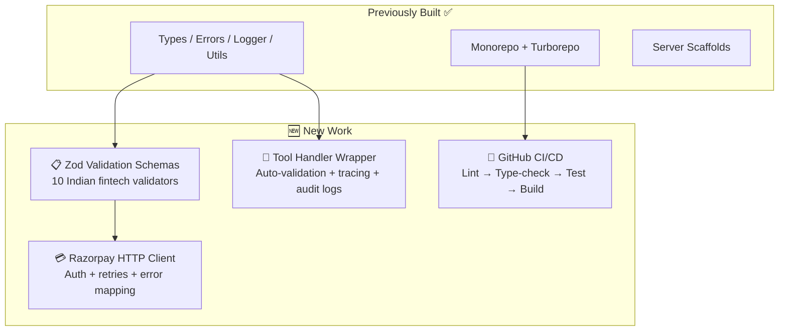
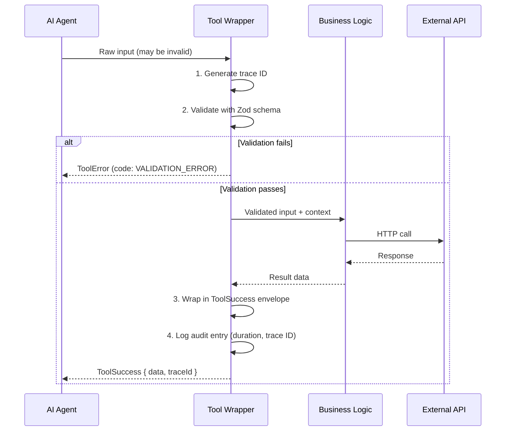
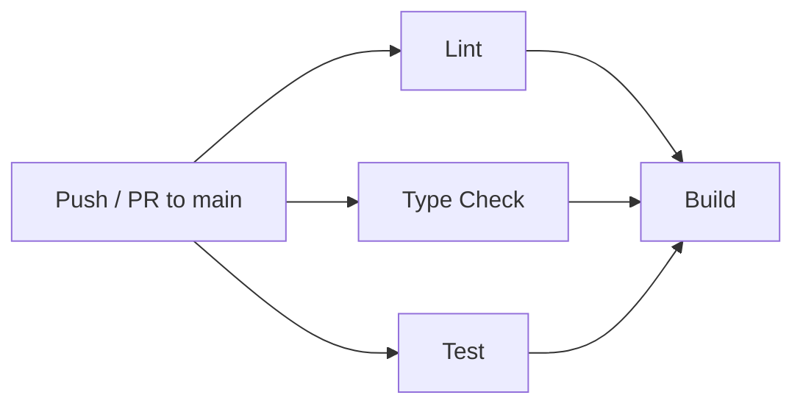

# Bharat-MCP — Updated Walkthrough 🏗️

**Last updated**: March 2, 2026 — Post Sprint 1.5 review

---

## What's New Since Last Time?

Since the last review, **7 new files** have been added across 3 areas. Here's the summary before we dive deep:



---

## 1. Zod Validation Schemas — `shared/src/schemas/common.ts` 🆕

**What is this?** A library of **10 reusable validators** for Indian financial data types. Each uses [Zod](https://zod.dev) — a TypeScript library that checks data at runtime (not just compile time).

**Why does this matter?** When an AI agent calls a tool like `search_taxpayer_by_gstin`, it sends a GSTIN number. But how do you know the AI didn't hallucinate a garbage value? These schemas **catch bad data before it hits the real API**.

### Every validator at a glance:

| Schema | Validates | Example Valid Value | What It Catches |
|:-------|:----------|:-------------------|:----------------|
| `GstinSchema` | GST Identification Number | `"27AAPFU0939F1ZV"` | Wrong length, invalid state code, bad format |
| `UpiVpaSchema` | UPI Payment Address | `"john.doe@okicici"` | Missing `@`, invalid characters |
| `PanSchema` | PAN Card Number | `"ABCPD1234E"` | Wrong entity type letter, bad length |
| `AadhaarSchema` | Aadhaar number (⚠️ PII) | `"234567890123"` | Starts with 0/1, wrong digit count |
| `AmountInPaiseSchema` | Money amount (in paise) | `50000` (= ₹500) | Negative values, decimals, exceeds ₹1Cr |
| `CurrencySchema` | Currency code | `"INR"` | Anything other than INR |
| `IdempotencyKeySchema` | UUIDv4 for dedup | `"550e8400-e29b-..."` | Non-UUID strings |
| `PaginationSchema` | Page controls | `{ skip: 0, count: 10 }` | Negative skip, count > 100 |
| `PhoneNumberSchema` | Indian mobile number | `"+919876543210"` | Missing +91, wrong digit count |
| `IfscCodeSchema` | Bank branch code | `"SBIN0001234"` | Wrong length, missing 5th-position zero |
| `FinancialYearSchema` | Indian FY format | `"2024-25"` | `"2024-26"` (end year must be start+1) |

### Beginner concept — What's a Zod `.describe()`?

Every schema has a `.describe(...)` with a **human-readable explanation**. This text is automatically used by MCP to tell the AI agent *what format the field expects*. The AI reads this description and generates valid data. Think of it as **instructions on a form field**.

```
Without .describe():  AI guesses → sends "GST123" → validation fails → error
With .describe():     AI reads "15-char alphanumeric, starts with state code..." → sends valid GSTIN
```

---

## 2. Tool Handler Wrapper — `shared/src/schemas/tool-wrapper.ts` 🆕

**What is this?** A **factory function** (`createToolHandler`) that wraps any MCP tool with automatic:



### What each step does (beginner-friendly):

| Step | What Happens | Why |
|:-----|:-------------|:----|
| **Trace ID** | Creates a unique ID (like a receipt number) for this call | So you can trace what happened from AI → server → Razorpay API and back |
| **Zod validation** | Checks if the AI's input matches the expected format | Prevents garbage data from hitting real payment APIs |
| **Business logic** | Your actual code runs (e.g., calling Razorpay) | This is the "real work" |
| **Result wrapping** | Wraps output in `{ success: true, data: ..., traceId }` | Every response has the same predictable shape |
| **Audit logging** | Logs tool name, duration, success/failure, trace ID | For compliance and debugging — "who did what, when" |
| **Error handling** | Catches all errors, maps them to proper types | AI gets a structured error it can reason about, not a crash |

### Also included: `formatToolResultForMcp()`

Converts the `ToolResult` envelope into the exact format the MCP protocol expects (`{ content: [{ type: "text", text: "..." }], isError: boolean }`). This is the bridge between our internal format and the MCP standard.

---

## 3. Razorpay HTTP Client — `mcp-server-razorpay/src/razorpay-client.ts` 🆕

**What is this?** A typed HTTP client that talks to Razorpay's REST API. Think of it as a **phone operator** — your tool says "create an order" and this client handles the actual phone call to Razorpay.

### Key features:

| Feature | What It Does | Beginner Analogy |
|:--------|:-------------|:-----------------|
| **Basic Auth** | Sends `key_id:key_secret` as base64 in every request | Like showing your ID badge at a building entrance |
| **Retry with backoff** | If Razorpay is temporarily down (500/502/503), waits and tries again up to 3 times | Like redialing a busy phone number, waiting longer each time |
| **Timeout** | Cancels the request if Razorpay doesn't respond within 30 seconds | Hanging up if nobody picks up after 30 seconds |
| **Error mapping** | Converts HTTP errors (401, 429, 500) into proper `McpError` types | Translating "server busy" into a message the AI understands |
| **Idempotency header** | Sends `X-Payout-Idempotency` header on mutation requests | Tells Razorpay "if you've seen this before, don't do it twice" |

### How retry backoff works:

```
Attempt 0: fails → wait ~1 second
Attempt 1: fails → wait ~2 seconds
Attempt 2: fails → wait ~4 seconds
Attempt 3: fails → give up, throw error
```

Each wait includes a small random "jitter" so multiple servers don't all retry at the exact same moment.

### Factory function: `createRazorpayClient()`

Reads `RAZORPAY_KEY_ID` and `RAZORPAY_KEY_SECRET` from environment variables automatically. If they're missing, throws `AuthenticationError` immediately — no silent failures.

---

## 4. GitHub CI/CD — `.github/` 🆕

Three new files that automate quality control whenever code is pushed:

### `workflows/ci.yml` — The Main Pipeline



- **Lint, Type Check, Test** run **in parallel** (faster feedback)
- **Build** only runs **after all three pass**
- Uses **Turborepo caching** to avoid rebuilding unchanged packages
- Node.js 22 + pnpm with `--frozen-lockfile` (no surprise dependency changes)

### `workflows/format-check.yml` — Prettier Check

Runs **only on pull requests** — checks that all code is properly formatted. If someone forgets to run `prettier`, this catches it.

### `dependabot.yml` — Auto-Update Dependencies

Automatically creates pull requests every Monday (IST 9:00 AM) when dependencies have updates. Groups minor/patch updates together to reduce PR noise. Covers both npm packages and GitHub Actions versions.

---

## Updated Progress Tracker

| Sprint | Task | Status |
|:-------|:-----|:-------|
| **1 — Foundation** | Turborepo + shared package + server scaffolds | ✅ Done |
| **1.5 — Schemas & Client** | Zod validators + tool wrapper + Razorpay client + CI/CD | ✅ Done |
| **2 — Razorpay Tools** | `create_order`, `fetch_payment_status`, `trigger_refund`, `list_subscriptions` | ⏳ Next |
| **3 — GSTN + Security** | GSTN tools + rate limiter + audit logger | ⏳ Pending |
| **4 — Packaging** | Docker + docs + E2E tests | ⏳ Pending |

---

## What's Ready To Be Built Next

All the **infrastructure** is in place. The next step is to implement the actual Razorpay tools using the pieces already built:

```typescript
// Example of how the next tool will look using existing infrastructure:
const handleCreateOrder = createToolHandler({
  name: 'create_order',
  schema: z.object({
    amount: AmountInPaiseSchema,          // ← from schemas/common.ts
    currency: CurrencySchema,             // ← from schemas/common.ts
    idempotency_key: IdempotencyKeySchema, // ← from schemas/common.ts
  }),
  handler: async (input, context) => {
    const client = createRazorpayClient();  // ← from razorpay-client.ts
    return client.post('/orders', input, input.idempotency_key);
  },
  logger,                                  // ← from shared/logger
});
// Tool wrapper automatically handles: validation, tracing, audit logging, error handling
```

Everything snaps together like LEGO blocks! 🧱
